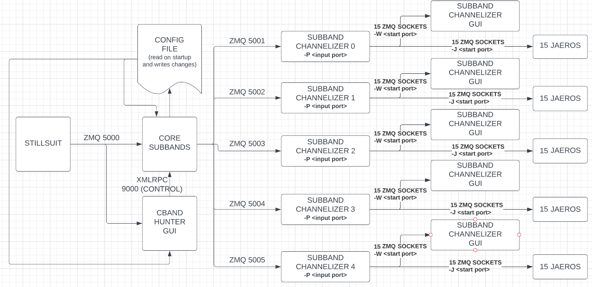
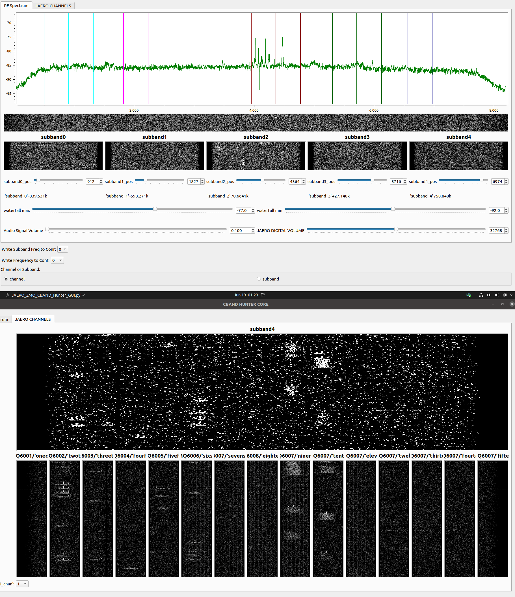

#CBandHunter (HIGHLY EXPERIMENTAL)

Fixed Sample Rate 2.16Msps

It is assumed you are using a downshifted source for C-Band (like the Titanium C1WPLL)

Hunting for bursts should start around 1534MHz.

The overall logic/flow of the application is shown below:



CBANDHUNTER will provides 5 manually tunable subbands to center around spectrum where bursts are present. (NOTE: It is NOT expected that you will run 75 instances of JAERO as not all channels will be occupied. The JAERO ZMQ sockets are only present to make all channels accessible to the USER) 


The ZMQ input can be provided with a publisher from my STILLSUIT project
https://github.com/muaddib1984/STILLSUIT
run STILLSUIT for your radio of choice (USRP,RTL-SDR, etc)

```./rtl_stillsuit.py -s 2.16e6 -f 1534e6 -g 1.0```

You can adjust frequency and gain appropriately in the command line.
Once running, stillsuit will publish the I/Q on port 5000

C-Band Hunter is comprised of standalone components as well as modular.

The aim is to provide a standalone app to confirm that the signals are being seen properly and JAERO can decode one/some of the channels. 

The modular approach allows the user to tune in all 5 subbands visually and then close all the GUI windows for headless operation.

**CONFIG FILE**
CBANDHUNTER uses GNURadio's config file format. The purpose is to allow the user the ability to make visual adjustments to the location of the subbands based on visually aligning them with the burst signals in the spectrum. This action will write the subband locations to the config file in the ```/tmp``` directory.
This allows the last location of the subbands to be saved and recalled preventing the user from the inconvenience and tedium of 'dialing in' all over each time they run the app. The GUI will no longer be necessary as the core applications will read from the config file with no user intervention required.

NOTE:Currently the modular core app still has a small GUI window for the JAERO input Volume control that is _non-functional_ at this time.

**STANDALONE:**
In the gr-JAERO/apps directory open the JAERO_ZMQ_CBAND_Hunter_core.grc in
GNURadio Companion, you can run it from there or generate the python code.
then run the JAERO_ZMQ_CBAND_HUNTER_GUI.grc flowgraph. That will allow you to
see the spectrum and different subbands, on the other tabs you will be able 
to see the single 10.5k channels from the channelizer.
run JAERO, open settings and set the zmq audio port to one of the 15 channels
in standalone these are 6001-6015

**MODULAR:**

Open the flowgraphs in the cband_hunter_modular directory and generate the
python code
cd into the cband_hunter_modular directoy in a terminal and run:
<pre>    python3 JAERO_ZMQ_CBAND_Hunter_core_subbands.py
    python3 JAERO_ZMQ_CBAND_Hunter_subband_channelizer.py -P 5001 -J 6001 -W 7001
    python3 ../JAERO_ZMQ_CBAND_Hunter_subband_channelizer_GUI.py -P 5001 -W 7001
    python3 JAERO_ZMQ_CBAND_Hunter_GUI.py</pre>
You should see spectrum in the main GUI and have the ability to adjust 
subband0 as shown in the top half of the image here:


If you are seeing C-Band burst signals somewhere in the spectrum, adjust the position for 
subband0 and put the subband window (3 colored lines) around the carriers. 
Then line up the carriers in the subband channelizer channel slots (shown in the bottom half of the image above)

There are 15 small waterfalls, one for each 10.5k channel. Once you are tuned in properly, you can run multiple jaero instances with the command:

```jaero -s [name of instance]```

The topic fields in the flowgraph are 'JAERO'. You will have to manually enable the 'ZMQ Audio' checkbox option and change the port to reflect the correct JAERO socket.

Each 10.5kbps channel operates on it's own ZMQ Port, but topics are still required as JAERO needs to see the correct topic to accept the stream. 

For operating all 5 subbands repeat the instructions above for the 
subband channelizer graphs:
For each subband, change the ```-P 5001``` to ```-P 5002```,```-P 5003```, ```-P 5004``` or ```-P 5005```
These port numbers correspond to the 5 subband I/Q streams shown in the logic diagram above.

For each subband, run a subband channelizer (and GUI) but change the 
```-W 7001``` flag to be ```-W 7016```,```-W 7032```,```-W 7048```, ```-W 7064``` and the ```-J 6001``` flag to ```-J 6016```,```-J 6032```,```-J 6048```,```-J 6064```

These numbers are the port numbers for the internal routing of channelized I/Q to waterfalls in the GUI flowgraphs (```-W```) and the individual
JAERO instances (```-J```), so JAERO will need to see the correct ports and topics.

I will do my best to further update these instructions at some point. 


