# gr-JAERO: a GNURadio interface for JAERO
gr-JAERO is a [GNURadio-based](https://github.com/gnuradio/gnuradio) Upper Sideband AM (USB) demodulator and custom ZMQ block that sends the demodulated audio band data over a ZMQ socket interface to the popular program "JAERO".
JAERO receives USB audio band data and decodes AERO mode SATCOM Signals. Read more about it [here](https://www.github.com/jontio/JAERO) This GNURadio Module provides a simple USB demodulator 
The Upper Sideband Demodulator is modeled directly after [SDRReceiver](https://github.com/jeroenbeijer/SDRReceiver) project which is also a USB demodulator/ZMQ interface to JAERO.   

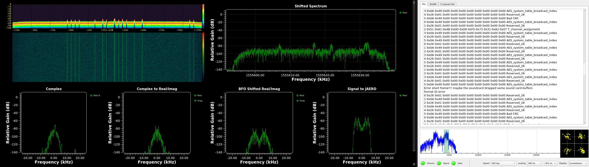

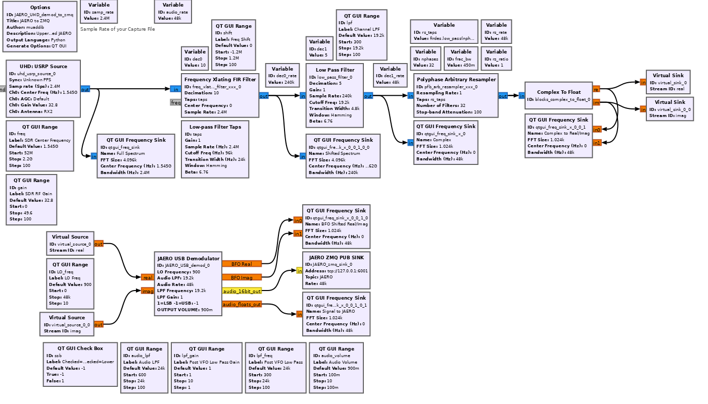
## Description
The aim of this project was simply to allow GNURadio users the 
ability to send demodulated data to JAERO. By leveraging the large
library of supported SDR's in GNURadio, that hardware can now be
interfaced into JAERO. 

Any Software Defined Radio (SDR) supported by GNURadio can be used.

This includes:
 - Ettus/National Instruments USRP (tested)
 - Great Scott Gadgets HackRF
 - LimeMicro LimeSDR (tested)
 - RTL-SDR (tested)
 - Nuand BladeRF
 - Adalm Pluto

(from the list above, please feel free to report success with any 'untested' radios)

Pre-recorded I/Q file types that can also be used are:
 - WAV format I/Q from SDR#
 - Raw '.cfile' or '.fc32' from GNURadio

## Dependencies
 - GNURadio
 - JAERO

gr-JAERO is a module for GNURadio, so GNURadio will need to be installed first. 
The dependencies that are included when installing 
GNURadio should cover anything that gr-JAERO needs.
There are up-to-date instructions on the various installation methods 
for GNURadio [here](https://wiki.gnuradio.org/index.php?title=InstallingGR)

If you are unfamiliar with GNURadio, there is a fantastic tutorial series [here](https://wiki.gnuradio.org/index.php?title=Tutorials)

## Installation
<pre>git clone https://github.com/muaddib1984/gr-JAERO
cd gr-JAERO 
mkdir build
cd build
cmake .. 
make
sudo make install
sudo ldconfig
</pre>
Once installed, open GNURadio and click navigate to the ```gr-JAERO/grc``` directory. Open the 
Go to the [JAERO](https://github.com/jontio/JAERO) project for installation instructions for JAERO.

## Contents
The gr-JAERO module includes the following:
 - Custom JAERO ZMQ PUB Sink block that sends 16-bit shorts to JAERO in a the ZMQ configuration that JAERO accepts. 

 - Upper Sideband Demodulator Heir block which emulates the same DSP 
in the [VFO section of SDRReceiver](https://github.com/jeroenbeijer/SDRReceiver/blob/700bdfa6a5bd517f9a6b8e67cca5342d06622954/vfo.cpp#L300-L332)

The included ZMQ PUB Sink in GNURadio does not have a way to send separate message types. JAERO requires that the sample
rate be sent along with every batch of 16-bit shorts it receives. This is to tell JAERO to automatically retune.

 - Example flowgraphs using the JAERO USB Demodulator and JAERO ZMQ Pub Sink for the following data sources:
   - RTLSDR
   - USRP (UHD)
   - I/Q WAV File (SDR#)
   - I/Q .cfile/.fc32 (GNURadio)

- Highly optimized demodulator based on the Upper Sideband Demodulator from [GQRX](https://github.com/gqrx-sdr/gqrx). This version of the demod is intended for use with the [Stillsuit](https://github.com/muaddib1984/stillsuit) project which is a wrapper around the same SDR sources above. Each Stillsuit flowgraph outputs the I/Q stream from an SDR over a ZMQ socket. The ZMQ output from the Stillsuit source you choose will feed the "JAERO_stillsuit_demod.grc" flowgraph.

## Usage
- Launch JAERO
  - in the JAERO settings menu, check the ZMQ Audio option and change set the address to 'tcp://127.0.0.1:6001'
  - 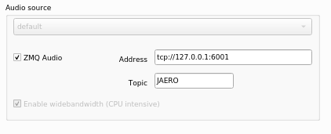
- In gr-JAERO/grc open the heir block called "JAERO_USB_demod_heir". Click the 'execute' (play icon) button, 
then click the reload blocks button to add the heir block to GNURadio.
- To use gr-JAERO with an RTLSDR:
  - In gr-JAERO/examples open the "JAERO_RTLSDR_demod_to_zmq.grc" flowgraph
- To use gr-JAERO with a USRP:
  - In gr-JAERO/examples open the "JAERO_UHD_demod_to_zmq.grc" flowgraph
- To use gr-JAERO with a pre-recorded I/Q file:
  - if your prerecorded I/Q file is a WAV format file recorded in SDR#
    - In gr-JAERO/examples open the "JAERO_WAV_IQ_file_demod_to_zmq.grc" flowgraph
  - if your prerecorded I/Q file is a .cfile or .fc32 recorded in GNURadio:
    - In gr-JAERO/examples open the "JAERO_IQ_file_demod_to_zmq.grc" flowgraph

All the flowgraphs follow the same general flow format:

I/Q stream -> USB demodulator -> float to short -> ZMQ -> JAERO

Open the flowgraph of choice for your I/Q stream (SDR Hardware, Pre-recorded I/Q file)
run the graph and the following window will open:

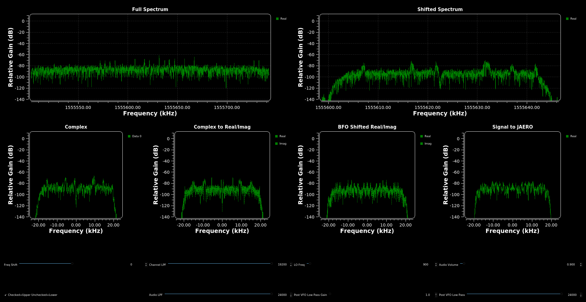

Adjust the 'Freq Shift' slider until a signal is about 1-2khz to the right of 0

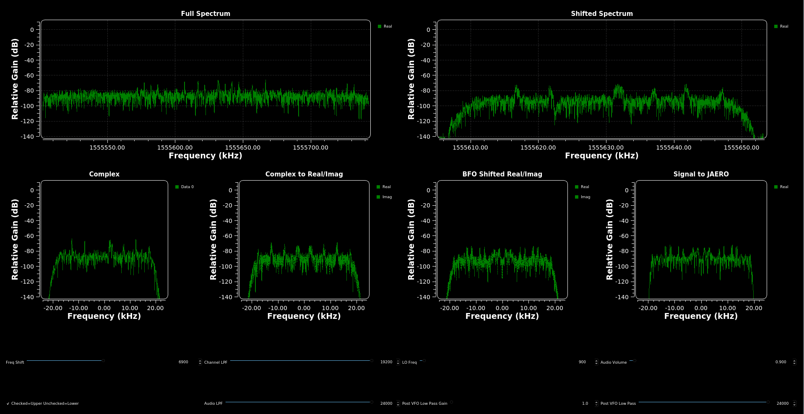

Then adjust the 'Channel LPF' slider to filter out other signals

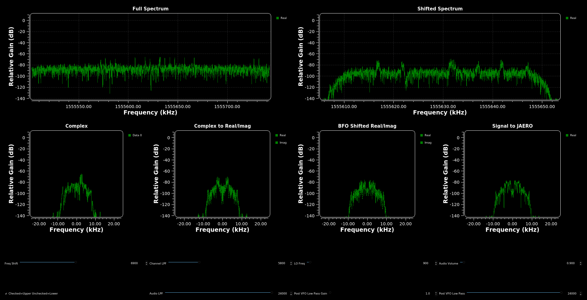

You will notice in the 'Complex to Real/Imag' FFT window that a mirror image has been
created as well.

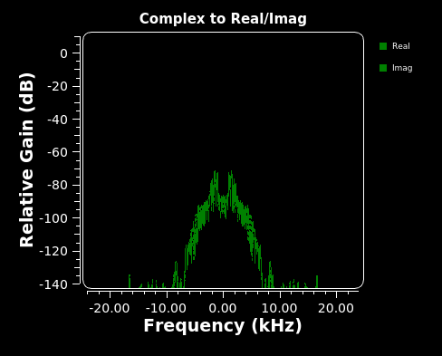

Now adjust the 'LO Freq' slider until you see 4 peaks in the 'BFO Shifted Real/Imag' window.

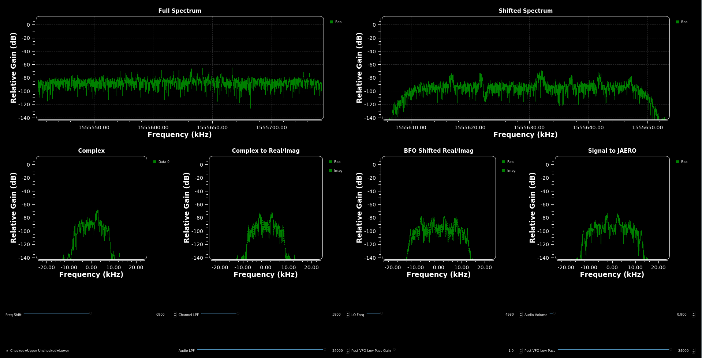

Only the spectrum to the right of 0 will be sent to JAERO. 

As an optional step, adjust the Audio LPF. This can remove some of the sideband noise.

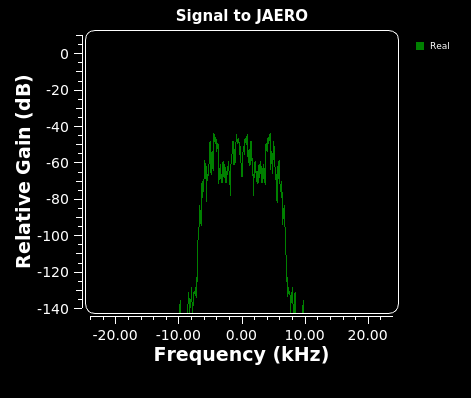

Switch to the JAERO application.
You should see the 2 peaks from the right side of the spectrum in the frequency window
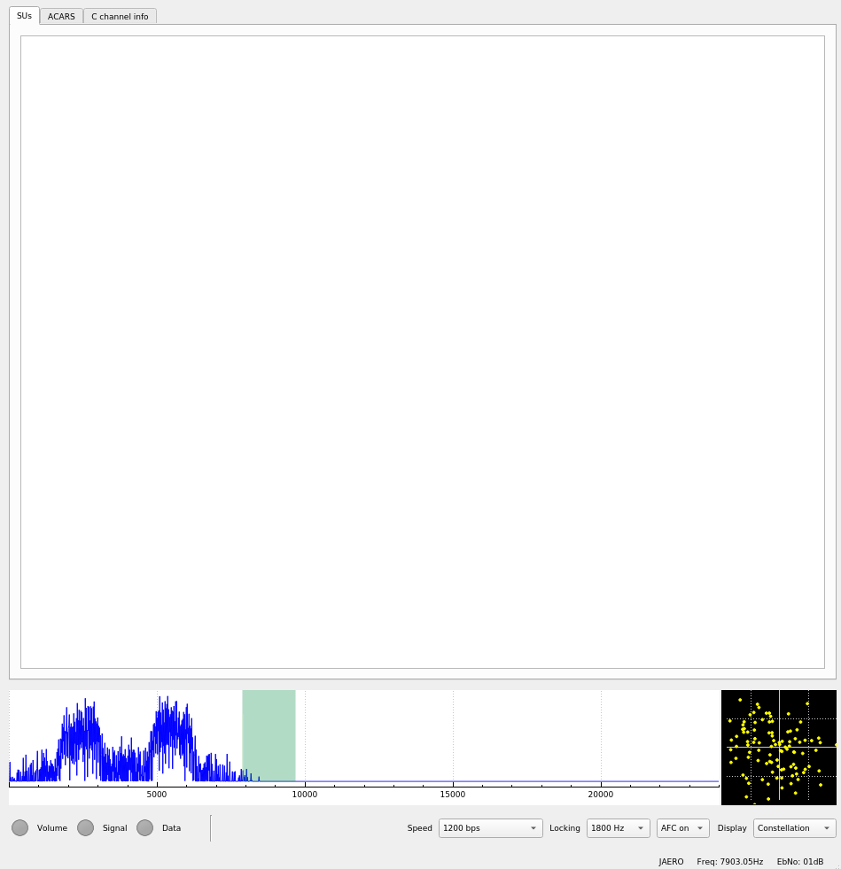
Depending on what types of channels you're looking at, you'll need to choose the correct bandwidth. 
The channel shown here is 1200bps, so I select 1200bps from the 'Speed' dropdown
and click on the right-most peak in the window.
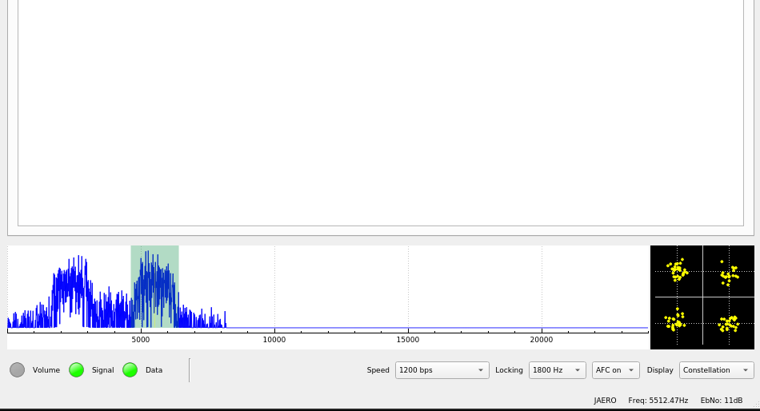
Adjust Volume as necessary in the GNURadio flowgraph by moving the 'Audio Volume' slider.
(you may see data in the 'SUs' console without the Volume light on, but it's good practice to have all lights green in JAERO)
You should see data in the 'SUs' console and/or the ACARS console and also the 'Plane Log' window. 

To use the highly optimized demodulator, you will first need the stillsuit project (link above). Choose the stillsuit flowgraph for your SDR (LimeSDR, RTLSDR, etc.), and start the flowgraph. Match the sample rate from your stillsuit flowgraph by editing the <code>sample_rate</code> variable in the <code>JAERO_stillsuit_demod.grc</code> flowgraph. will connect to your SDR and output the I/Q samples to ZMQ. The usage is the similar to the above, however there is no need to tune the LO.

## Testing/Verification

Testing has been done with live SDR data streams and pre-recorded I/Q files.
For Live testing a Nooelec L-Band Patch antenna with Nooelec Sawbird IO Filter/LNA was used.
SNR of 6-10dB is ideal.
Pre-recorded I/Q file demod/decode of 600bps, 1200bps,10500bps channels has been successful. 
Live demod/decode from live 600bps and 1200bps channels has been successful. 
Continued effort will be focused on live demod/decode of 10500bps and 8400bps.
Success stories and I/Q recordings of 8400bps are welcome.
==**update APRIL 2022**==

Overhauled my RF Frontend/USB Demodulator and added a C-Band Dish:
600/1200/10500/8400 in L-Band AND 10500-burst in C-Band have been decoded successfully with gr-JAERO!!!
Still on the hunt for 1200bps bursts, gotta catch 'em all!


==**update APRIL 2022**==
Overhauled my RF Frontend/USB Demodulator and added a C-Band Dish:
600/1200/10500/8400 in L-Band AND 10500-burst in C-Band have been decoded successfully with gr-JAERO!!!
Still on the hunt for 1200bps bursts, gotta catch 'em all!

## Credits
I can't thank [Jontio](https://github.com/jontio) enough for his help figuring this out. 
You are truly gifted in the discipline of "Waves to Words", your ninjitsu is strong.
I also couldn't have done this if [JeroenBeijer](https://github.com/jeroenbeijer) hadn't
spearheaded the ZMQ effort and walked me through his USB demodulator implementation. We 
all learn together!
